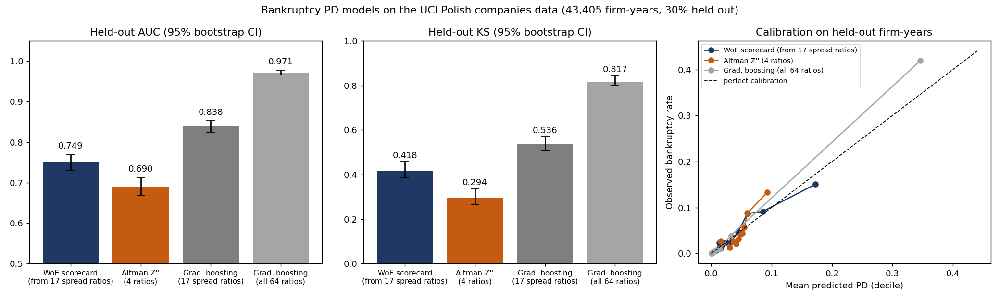
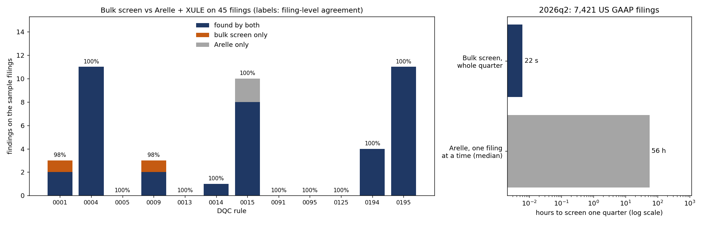

# Commercial Credit Risk Engine

A first-pass credit memo for a public borrower, built from its SEC XBRL filings (spread, covenant stress tests, default risk), plus a bulk XBRL data-quality screen that flags bad filing values first. For commercial-banking and credit analysts.

## Results

- **Default-risk scorecard beat Altman Z'': AUC 0.749 vs 0.690** on held-out data (43,405 real firm-years), inside a Python credit engine that turns SEC XBRL filings into credit memos with covenant stress tests and Merton distance-to-default.
- **Screened all 7,421 filings of an SEC quarter for XBRL data errors in 23 s**, where Arelle needs 27 s per filing, by porting 14 XBRL US DQC rules to vectorised pandas over SEC flat files.
- **Matched Arelle/XULE on 40 of 44 findings across 45 real filings**, with every disagreement traced to a cause, via a differential test harness and planted-error tests.
- **Generated an Excel exceptions report of 451 flagged values** for a full quarter, with suggested corrections and linked summary and rule sheets.



**Stack:** Python, pandas, scikit-learn, SciPy, openpyxl (Excel), LibreOffice (headless recalculation), SEC EDGAR XBRL API, Arelle/XULE (reference runs), pytest

## Quickstart

```bash
python3 -m venv .venv && . .venv/bin/activate && pip install -e ".[test]"
CREDIT_ENGINE_USER_AGENT="Your Name you@example.com" credit-engine memo --cik 106640 --out out/   # Whirlpool, live from EDGAR
credit-engine dqc --quarter 2026q2 --out out/dqc                                                  # screen a whole SEC quarter
```

For the Excel recalculation check, install LibreOffice Calc: `sudo apt-get install -y --no-install-recommends libreoffice-calc`. Without it, the memo is still written and the workbook simply calculates when opened.

Each run writes `out/<borrower>_memo.md` and `out/<borrower>_spread.xlsx`. Finished examples for Hasbro, Whirlpool, Kohl's, Mattel and Macy's (plus an illustrative private borrower) are in [examples/](examples/).

## Results in detail

| Model (held-out 30%, 627 bankruptcies) | AUC [95% CI] | KS | Brier | ECE |
|---|---|---|---|---|
| WoE scorecard (6 ratios a US spread can supply) | 0.749 [0.730, 0.768] | 0.418 | 0.044 | 0.008 |
| Altman Z'' baseline | 0.690 [0.668, 0.712] | 0.294 | 0.045 | 0.016 |
| Gradient boosting, same 17 candidate ratios | 0.838 [0.824, 0.853] | 0.536 | 0.041 | 0.007 |
| Gradient boosting, all 64 ratios | 0.971 [0.966, 0.976] | 0.817 | 0.019 | 0.009 |

Full tables with CIs for every metric and decile calibration: [reports/benchmark.md](reports/benchmark.md).



| DQC data-quality screen, SEC Financial Statement Data Set 2026q2 | Result |
|---|---|
| Whole quarter (7,421 US GAAP filings, 3.19 M facts), 14 rules | 8.2 s load + 14.6 s screen; 451 findings in the [Excel exceptions report](reports/dqc_exceptions_2026q2.xlsx) |
| Arelle + XULE + official DQC v30 ruleset | median 27.1 s per filing (≈ 56 CPU-hours per quarter) |
| Agreement with Arelle on 45 filings (findings matched) | 40 of 44; filing-level agreement 97.8–100% per rule |
| Disagreements | 4, all root-caused as data-set flattening limits (2 facts missing from `num`, 1 month-end merge of two dates, 1 member hierarchy the data sets drop); 0 unexplained |
| Flagged values that move a leverage or coverage ratio | 6 of 451 hit a spread input; none changes a ratio by more than 0.5% |

Per-rule agreement, root causes, the bugs the comparison exposed and the runtime method are in [reports/dqc_results.md](reports/dqc_results.md).

## Why

A credit analyst spreads a borrower's statements into a standard template, computes leverage and coverage, checks covenant headroom, and judges default risk. This is usually done by hand in spreadsheets, and the default judgment is rarely checked against outcomes. This engine automates the spread from public XBRL data, finds the exact shock that breaks each covenant, and backs its PD with a model measured against real bankruptcies and the Altman Z'' baseline.

The spread is only as good as the filing behind it. XBRL filings contain sign flips, wrong periods and totals that don't match their components. XBRL US's Data Quality Committee publishes [rules that catch these errors](https://xbrl.us/home/priorities/data-quality/rules-guidance/) and [tracks how often filings break them](https://xbrl.us/data-quality/center/), but the rules run one filing at a time inside an XBRL processor such as Arelle. An analyst who loads thousands of filings into pandas for peer comps has no equivalent screen, so bad values go straight into leverage and coverage ratios. The `dqc` command runs 14 frequently triggered DQC rules over a whole quarter of the SEC's flattened Financial Statement Data Sets at once.

## Screening a quarter for data-quality errors

```bash
credit-engine dqc --quarter 2026q2 --out out/dqc     # any quarter listed at sec.gov/dera/data/financial-statement-data-sets
credit-engine dqc --path ~/Downloads/2025q4.zip      # a quarter zip (or unzipped folder) you already have
credit-engine dqc --fixture                          # offline: the 45 committed sample filings
```

The command downloads the quarter if needed (set `CREDIT_ENGINE_USER_AGENT="Your Name you@example.com"`, as the SEC asks) and prints findings per rule. It then writes two files:

- `dqc_findings_<quarter>.csv` has one row per finding: accession number, rule and rule element ID, concept, period, dimensions, reported value, suggested correction and the rule message.
- `dqc_exceptions_<quarter>.xlsx` opens on a **Summary** sheet with findings and flagged filings per rule. Each rule ID links to its own sheet, which lists filer, CIK, form, accession number (linked to the filing on EDGAR), concept, the statement it is presented on (BS/IS/CF/EQ, or UN for notes), period, dimensions, reported value, suggested correction and the rule message. Use the column filters to find one borrower.

How to read the suggested correction:

| Rule | Correction |
|---|---|
| Negative values (0013, 0014, 0015, 0125, 0194) | The absolute value: the usual cause is a sign entered for presentation. |
| Totals that don't add up (0004) | The sum of the reported components. |
| A ≤ B checks (0009) | The B value. |
| Percentages over 1,000% (0091) | The value ÷ 100. |
| Share scale (0095) | The cover-page shares, rescaled by a power of 1,000. |
| Document period (0036) | The period the statements actually report. |
| Member checks (0001, 0195), dates (0005) and reversed calculations (0008) | None: someone has to decide where the fact belongs. |

Before a covenant test, check the filings of the borrower and its peers. A flagged `LongTermDebtNoncurrent`, `InterestExpense…` or `OperatingIncomeLoss` value feeds the spread directly. [reports/dqc_results.md](reports/dqc_results.md) measures how often that happens.

## Reading a memo

| Section | What it tells you |
|---|---|
| 1. Summary | Risk grade (1–10 master scale), leverage/coverage headline, covenant pass count, the first covenant to break under each stress, Z'' zone and market-implied PD. |
| 2. Financial spread | 26 standardized line items for the last 4 fiscal years, in $M. |
| 3. Credit ratios | EBITDA, Debt/EBITDA, net leverage, EBIT/interest, DSCR, fixed-charge coverage, current ratio, free cash flow, debt/equity. `n/m` when EBITDA ≤ 0. |
| 4. Covenant compliance | Threshold, actual, headroom (% of threshold) and PASS/BREACH for the latest year. Covenants come from `fixtures/borrowers.json` or `--covenants my_covenants.json`. |
| 5. Stress tests | The EBITDA decline, floating-rate shock (bp) and revenue decline at which each covenant breaks. |
| 6. Probability of default | Scorecard PD and points with per-ratio contributions; Altman Z'' and zone; Merton inputs (equity value, 252-day volatility, KMV default point) and solved asset value/volatility, distance-to-default and PD. |
| 7. Data sources and checks | The XBRL tag behind every latest-year cell, and the LibreOffice formula-parity result for the Excel file. |

In the Excel spread, blue cells on `Spread` are inputs. `Ratios` and `Covenants` are live formulas, so an analyst can overwrite an input (for example, an EBITDA adjustment) and watch headroom update.

## How it works

- **Spreading** (`credit_engine/spreading.py`): reads EDGAR `companyfacts` JSON (free; only a User-Agent is needed). Each line item has an ordered list of US-GAAP tags and derived fallbacks, e.g. interest expense → `InterestExpense` → `InterestExpenseNonoperating` → −`InterestIncomeExpenseNet` → `InterestPaidNet`. Only 10-K facts are used, with flows of 350–380 days and instants within 10 days of the year-end. Restated values from later filings take precedence, and retail 52/53-week years are labelled the way the companies label them. Every cell records its source tag.
- **Ratios and covenants** (`ratios.py`): EBITDA adds back non-cash impairments, a standard covenant add-back. Formulas are in the module docstring.
- **Stress** (`stress.py`): each scenario is a function of shock size. A grid brackets the first sign change of covenant headroom, and `scipy.optimize.brentq` refines it to 1e-10.
- **PD scorecard** (`scorecard.py`): the scorecard is trained on the UCI Polish companies bankruptcy data (`polish.py`), using only the 17 ratios that can also be computed from a US spread. Features are quantile-binned, and adjacent bins are merged until they are monotonic with at least 5% of rows each. Weight-of-evidence and information value come with Laplace smoothing. Features are then filtered on IV ≥ 0.02 and |WoE correlation| ≤ 0.8, and a sign-checked logistic regression is fitted. Points are scaled to 600 at 50:1 odds, with 20 points to double the odds.
- **Baselines** (`altman.py`, `benchmark.py`): Altman Z'' = 6.56·WC/TA + 3.26·RE/TA + 6.72·EBIT/TA + 1.05·BVE/TL, mapped to a PD by a one-feature logistic fit. scikit-learn `HistGradientBoostingClassifier` is fitted on the same 17 ratios and on all 64.
- **Evaluation** (`metrics.py`): stratified 70/30 split. AUC, KS, Brier and ECE use 1,000 stratified bootstrap resamples, plus paired bootstrap AUC differences.
- **Merton** (`merton.py`): solves E = V·N(d1) − D·e^(−rT)·N(d2) and σE·E = N(d1)·σV·V jointly in log space with `scipy.optimize.root`. Equity value is the latest price × shares outstanding (dei), and σE comes from 252 daily log returns.
- **Excel** (`excel.py`): openpyxl writes formula cells, headless LibreOffice recalculates them, and every ratio cell is compared with the Python value (relative tolerance 1e-9).
- **Data-quality screen** (`credit_engine/dqc/`): `fsds.py` loads the `sub`, `num`, `pre` and `tag` tables of a quarter and normalises them. Each fact gets its period start and end, its dimension count, whether it is an extension concept, and an estimated precision (the data sets have no `decimals` column). Each rule is a module in `dqc/rules/` whose docstring quotes the DQC rule text and lists the rule element IDs it covers:

  | Rule | What it checks |
  |---|---|
  | 0001 | Axis members |
  | 0004 | Assets = liabilities + equity, plus 11 other accounting identities |
  | 0005 | Dates of cover-page shares, subsequent events and forecasts |
  | 0008 | Calculations reversed against the US GAAP calculation linkbase (needs a `cal` table, see below) |
  | 0009 | A ≤ B pairs, e.g. shares outstanding ≤ issued |
  | 0013 | Tax-rate items when pre-tax income is positive |
  | 0014, 0015 | Negative values; 0015 uses the official 6,400-concept list and its member exclusions |
  | 0036 | Period of report vs the period the face statements report (approximation, see below) |
  | 0091 | Percentages > 10 |
  | 0095 | Share scale |
  | 0125 | Negative lease cost |
  | 0194, 0195 | Members of the equity components axis |

  Rules work on whole-quarter DataFrames: pivots on (filing, period, unit, dimensions), merges and vectorised masks. Allowed axis members come from the US GAAP 2025 definition linkbases (`scripts/build_ugt_members.py`).
- **Differential harness** (`scripts/dqc_arelle_harness.py`, `dqc/compare.py`): it downloads each sample filing's XBRL zip from EDGAR and runs `arelleCmdLine --plugins "validate/DQC|EDGAR/transform"` with the official DQC v30 compiled ruleset for the filing's US GAAP year. The findings are reduced to JSON in `fixtures/dqc/arelle/`. Arelle's contexts are then mapped to the data-set form (month-end-rounded dates, `Axis=Member;` without prefixes or suffixes), and findings are aligned on (filing, rule, concept, period, dimensions). Every one-sided finding needs a reviewed root cause in `fixtures/dqc/root_causes.json`; the test suite fails on any it cannot explain. `dqc_arelle_harness.py inspect <accession> <concept>` prints a concept's exact contexts from the filing to help find the cause.
- **Ratio impact** (`dqc/impact.py`): it builds a one-period spread per filing from the data set using the same tag priority as the spreader. It then substitutes each flagged value's suggested correction and recomputes the leverage and coverage ratios.

## Data

- UCI Polish companies bankruptcy data (Tomczak, Zięba et al., 2016; [UCI #365](https://archive.ics.uci.edu/dataset/365/polish+companies+bankruptcy+data), CC BY 4.0).
- SEC EDGAR XBRL [companyfacts API](https://www.sec.gov/search-filings/edgar-application-programming-interfaces).
- Free daily adjusted closes (Yahoo Finance chart endpoint, saved as `date,adj_close` CSV). `--prices my.csv` accepts any CSV in that format.
- SEC [Financial Statement Data Sets](https://www.sec.gov/dera/data/financial-statement-data-sets), quarter 2026q2 (60 MB zipped). `fixtures/dqc/fsds_sample/` holds the rows of the 45 sample filings.
- XBRL US DQC rules, [DataQualityCommittee/dqc_us_rules](https://github.com/DataQualityCommittee/dqc_us_rules) (v30). `credit_engine/dqc/resources/` holds unmodified copies of the DQC_0015 concept lists, under the DQC license and copyright notice in `LICENSE-DQC.md`. The reference run used [Arelle](https://github.com/Arelle/Arelle) (`pip install arelle-release`) with the XULE plugin ([xbrlus/xule](https://github.com/xbrlus/xule)) and the [Arelle EDGAR plugin](https://github.com/Arelle/EDGAR). None of their code is part of this package.

`python scripts/download_data.py` fetches all of it into `data/` (`--fsds 2026q2` fetches one data-set quarter); `--record` refreshes the small trimmed copies in `fixtures/` that make every test and the acceptance commands run offline. The offline benchmark uses a committed 8,000-row random sample of the Polish data. `python scripts/plot_results.py` regenerates the PD figure from `reports/*.csv`. `python scripts/dqc_results.py` rebuilds `reports/dqc_results.md`, its CSVs and the 2026q2 exceptions workbook; `--offline` rebuilds only the comparison from the fixtures. `python scripts/plot_dqc.py` then draws `docs/dqc_agreement.png`.

## Tests

```bash
python3 -m pytest -q                                              # 118 tests, ~7 s
python3 -m pytest -q tests/dqc                                    # the data-quality screen alone
python3 -m credit_engine benchmark --offline-fixtures --quick     # benchmark on the committed sample
python3 -m credit_engine memo --fixture sample_borrower --out out/
```

The suite checks:
- FY2023 revenue, operating income and net income for 5 recorded filers against their 10-Ks, plus tag priority and fallbacks.
- Every ratio, headroom and stress breakpoint for the round-number sample borrower against hand-worked closed forms.
- WoE/IV against a hand-computed two-bin case, plus binning monotonicity.
- The Merton round-trip on 40 random synthetic firms to 1e-6, and the Hull textbook example.
- Excel formula parity after LibreOffice recalculation; these tests are skipped only if `soffice` is not installed.
- Each of the 14 DQC rules on hand-built filings with planted errors and the near-misses it must not flag. These cover tolerances, member exclusions, dimension handling, stock-split skips and the 10% materiality test.
- Bulk vs Arelle on the 45 committed reference filings: there must be at least 40 runs, every disagreement must have a reviewed root cause, and every root-cause entry must still be used.
- Ratio impact for a sign-flipped debt value (leverage goes from −2.5x to 2.5x), and for 10-Q annualisation.
- Every hyperlink in the exceptions workbook resolves, both in a generated workbook and in the committed 2026q2 report.

## Limitations and next steps

- **Population mismatch.** The scorecard learns from Polish (mostly manufacturing) firms, so its PD is a relative-risk signal for US borrowers, not a calibrated 1-year US PD. The memo grade therefore takes the more conservative of the scorecard and Merton PDs.
- **Gradient boosting on 64 ratios scores far higher**, but it uses ratios a GAAP spread cannot supply. The Polish files also repeat firms across horizons without IDs, so a random split likely flatters flexible models. The scorecard is kept for transparency and portability.
- **Reported EBITDA.** EBITDA is reported, with impairment add-backs only. There are no other management adjustments, and lease cost uses `OperatingLeaseCost` where it is tagged.
- **Stress simplifications.** Stress holds cash taxes, capex and the balance sheet at base values. The floating-rate share of debt is an input, not something read from filings.
- **Spreading coverage.** Spreading covers common commercial and industrial filers. Banks, insurers and REITs use different statement structures and are out of scope.
- **Illustrative scale.** The 10-grade master scale and default covenant thresholds are illustrative and are not any institution's methodology.
- **14 of about 200 DQC rules.** The screen covers frequently triggered rules that a flat table can express. Two need data the quarterly data sets lack:
  - **DQC_0008** (reversed calculations) runs on a `cal.txt` calculation table, as shipped in the SEC's monthly *Financial Statement and Notes* data sets. The quarterly sets have none, so it finds nothing on the 2026q2 run. For the 45 reference filings, `scripts/dqc_arelle_harness.py cal` builds that table from each filing's calculation linkbase, and the rule matches Arelle's one finding exactly.
  - **DQC_0036** compares the `DocumentPeriodEndDate` value with its context, and the data sets carry neither. The module checks the same "not rolled forward" error one step removed: the period of report (`sub.period`) against the latest balance-sheet instant and current-period flows. Gaps under a month are invisible after month-end rounding.

  Other calculation and text rules (0043–0048 cash-flow checks, DQC_0033) are not implemented. Within a rule, a few element IDs are left out and documented in the module, such as 0004.9285 and 0195.10625.
- **What the data sets flatten away**, and the disagreements it causes:
  - Dates are rounded to the nearest month end, so DQC_0005 only flags dates clearly before the period end.
  - There is no `decimals` column, so tolerances use an estimated precision.
  - Namespaces are stripped, so an extension member with a US GAAP name looks like the US GAAP member.
  - Members appear only when a fact uses them, so DQC_0001 cannot see members that exist only in the extension taxonomy.

  Each case found in the sample is listed with its cause in `reports/dqc_results.md`.
- **US GAAP only.** Filings tagged with IFRS are skipped, since XBRL US publishes separate IFRS rules.

Project period: 2026-08-24 to 2026-10-02.
